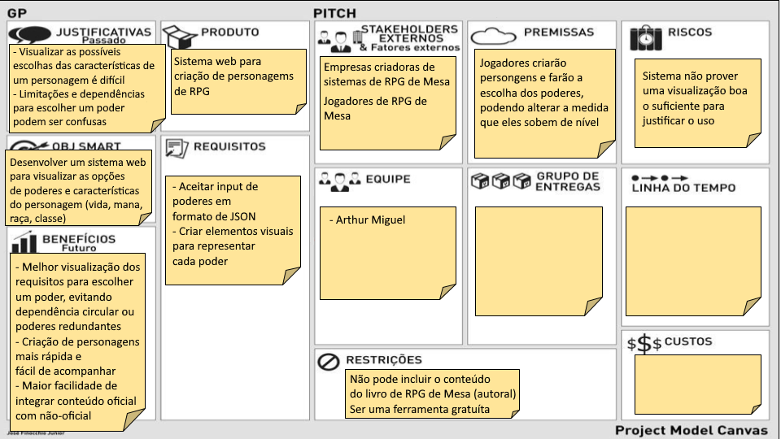
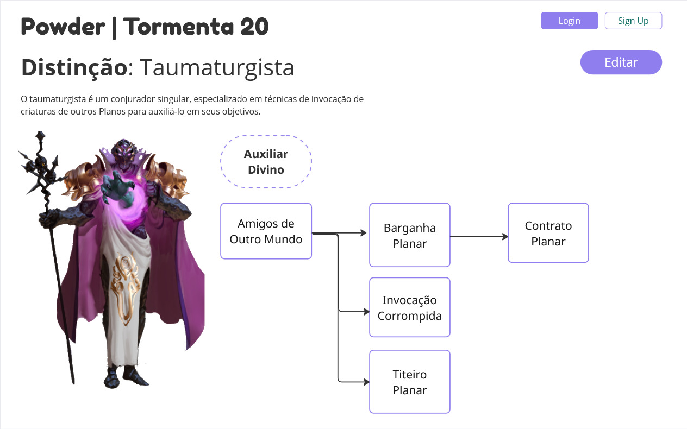

# 📘 Documentação do Projeto - Desenvolvimento Web

---

## 🧾 Visão Geral

Este projeto visa o desenvolvimento de um sistema WEB de criação de personagens de RPG de mesa. Ele permite a importação da lista de poderes para criar uma visualização com os efeitos e descrição de cada um, bem como as dependências, além da criação de personagens.

---

## ✅ Backlog

| ID    | Prioridade | História de Usuário                                                                 |
|-------|------------|--------------------------------------------------------------------------------------|
| HU-1  | 1️⃣         | **No papel de jogador**, desejo **criar personagens e poder definir as características básicas dele**, para facilitar a criação de personagens. |
| HU-2  | 2️⃣         | **No papel de jogador**, desejo **selecionar poderes para o meu personagem**, para deixar anotado numa forma mais fácil de visualizar. |
| HU-3  | 3️⃣         | **No papel de jogador**, desejo **visualizar quais são as relações entre os poderes**, para organizar quais as possíveis escolhas. |
| HU-4  | 4️⃣         | **No papel de escritor**, desejo **juntar poderes não oficiais com oficiais**, para facilitar a fase de testes. |
| HU-5  | 5️⃣         | **No papel de escritor**, desejo **ver o resultado final da escolha de poderes**, para ter uma melhor noção do equilíbrio do jogo. |

---

## 🎨 Protótipo de Telas

Cada funcionalidade descrita no backlog possui ao menos uma tela representando sua interface esperada.

### 🖼️ Protótipo do Requisito HU-1

**Figura 1**: Tela de listagem de produtos com imagem, nome e preço — correspondente à história de usuário HU-1.

---

## 🏗 Análise e Projeto 

O projeto  do sistema 

### Modelo 

### Esboço da arquitetura geral (cliente-servidor)

### Autorização  e Autenticação 
A autorização no Strapi (a partir do v4 e mantida no v5) é baseada em perfis de usuários (roles) e permissões atribuídas a esses perfis. Ela define o que cada usuário pode ou não pode fazer ao interagir com os endpoints da API.

1. Tipos de usuários
O Strapi tem dois contextos principais de usuários:

🔹 Usuários Autenticados
Criados via cadastro/login na API pública.

Associados a uma role do tipo “Authenticated” ou outra personalizada.

Usam token JWT para acesso autenticado.

🔸 Usuários Administrativos
Criados via painel de administração do Strapi.

Usam o Strapi Admin Panel.

Gerenciados separadamente e com permissões diferentes.

### Tecnologias a serem utilizadas 
Strapi, HTML, CSS, SQLITE....

---

### Telas do sistema

**Figura 2**: Tela de listagem de produtos com imagem, nome e preço — correspondente à história de usuário HU-1.

